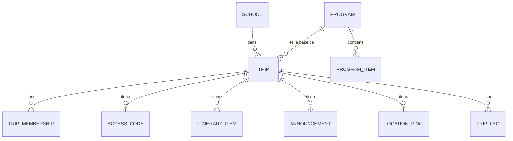

# Meridiano Cero — Estado actual del sistema

> Documento generado a partir del código real del repo `meridiano-cero` (panel web). Refleja lo que existe hoy, no un roadmap.

## 1. Qué es

Plataforma de seguimiento operativo para giras escolares. Conecta tres roles — **administrador** (colegio/operador de la gira), **monitor** (acompaña al grupo en terreno) y **apoderado** (familia) — alrededor de una **gira** (`Trip`): su ubicación en vivo, su itinerario día a día y sus comunicados.

Este repo es la app web (Next.js 16, App Router). Existe además una app móvil nativa separada (Expo, repo `meridiano-cero-app`) para los roles Monitor y Apoderado. Ya tiene construido: login (Clerk), canje de código, itinerario en vivo, comunicados por plantilla, modo oscuro, eliminación de cuenta y transmisión de GPS con arranque automático. Las rutas web `/monitor/[tripId]` y `/parent/[tripId]` descritas aquí son la versión que sigue en producción de esos dos roles mientras la app nativa termina de madurar.

## 2. Stack

- **Next.js 16** (App Router, Turbopack) — el repo usa `proxy.ts` en vez de `middleware.ts` y otras convenciones que difieren del Next.js "clásico" (ver `AGENTS.md`).
- **Tailwind CSS v4** (config CSS-first en `app/globals.css`, sin `tailwind.config.js`) + `tw-animate-css` para las utilidades `animate-in`/`animate-out`.
- **shadcn/ui**, componentes vendidos a mano en `components/ui/`, más un puñado de componentes tomados de ReUI (`components/reui/`) — timeline con hitos, drawer.
- **Prisma ORM** sobre **PostgreSQL** (Neon).
- **Clerk** para autenticación (sign-in/sign-up, sesiones, `AdminUser`/membresías de gira).
- **Zod** para validación de payloads de API.
- **Vercel Blob** para las fotos que suben los monitores.
- **Vitest** + `@testing-library/react` para tests unitarios; GitHub Actions corre lint + `tsc` + tests en cada push/PR.
- **`xlsx` (SheetJS)** para parsear el Excel del importador masivo (ver §8).

### Entornos y credenciales

- **`.env` local = siempre development** (base Neon de desarrollo, instancia de Clerk de prueba). No se cambia a producción.
- **Producción vive solo en Vercel** (Settings → Environment Variables, entorno *Production*). El entorno *Preview* (deploys de ramas/PRs) debe apuntar a la base de desarrollo, nunca a la de producción.
- **Las migraciones se aplican al desplegar**: `npm run build` es `prisma migrate deploy && next build`, así que cada deploy migra la base de *su* entorno usando `DIRECT_URL`. Esa variable tiene que existir en Vercel para Production y Preview. Correr `npm run build` en local migra la base de desarrollo del `.env`.
- **Comandos puntuales contra producción** usan un archivo aparte, `.env.prod` (ignorado por git), cargado explícitamente — p. ej. `ENV_FILE=.env.prod npx tsx scripts/seed-admin.ts <email>`, o `node --env-file=.env.prod node_modules/.bin/prisma migrate status`. No usar los nombres `.env.production` / `.env.production.local`: Next los carga solo en cada `next build` local.

## 3. Modelo de datos (Prisma)

- `TripMembership` — `clerkUserId` + `role` (`PARENT` | `MONITOR`).
- `AccessCode` — código canjeable → rol + gira.
- `ItineraryItem` — `status`: `PENDING` | `IN_PROGRESS` | `COMPLETED`.
- `Announcement` — `type`: `INFO` | `ALERT` | `ACHIEVEMENT`.
- `LocationPing` — lat/lng/accuracy, histórico de GPS.
- `TripLeg` — tramos de una gira multi-destino.

Entidades sin relación directa en el diagrama:
- `AdminUser` (`clerkUserId`) — acceso total, no depende de `TripMembership`.
- `AnnouncementTemplate` — mensajes predefinidos que usa el monitor.
- `ActivityTemplate` — actividades predefinidas para armar itinerarios.
- `RedeemAttempt` — rate-limit del canje de códigos.
- `Notification` — feed de notificaciones del panel admin (ver §5.1), incluidos los errores del sistema (§5.2). `tripId` opcional, con borrado en cascada si se elimina la gira.

Puntos clave del modelo:

- **`Trip.programId` es obligatorio.** Toda gira nace de un `Program` (plantilla de itinerario reutilizable); no existen giras "desde cero". El `Program` no puede borrarse mientras alguna `Trip` lo referencie (`onDelete: Restrict`, con mensaje de error explícito en la API).
- **Copiar, no enlazar.** Al crear una gira o aplicar un programa a una gira existente, los `ProgramItem` se copian como `ItineraryItem` nuevos. Editar el programa después no reescribe giras que ya lo aplicaron — el programa es un punto de partida, no una fuente viva.
- **`AccessCode`** es el mecanismo de invitación: un código único por rol y gira; canjearlo crea una `TripMembership`. Rate-limited (10 intentos / 15 min por usuario) vía `RedeemAttempt`.
- **`AdminUser`** es una tabla aparte de `TripMembership` — un admin no "pertenece" a ninguna gira, tiene acceso a todas.
- **Campos de `Trip` en inglés** (`groupNumber`, `grade`, `salesExecutive`) aunque el resto de la planilla operativa y la UI los muestren en español ("N° Grupo", "Curso", "Ejecutivo") — es una convención de nombres de código, no afecta lo que ve el usuario.

## 4. Roles y control de acceso

Todas las rutas bajo `/admin`, `/parent`, `/monitor`, `/redeem` y `/api/v1` exigen sesión de Clerk (`proxy.ts`). Dentro de eso, `lib/api/require-role.ts` define cuatro guards usados por cada endpoint:

- **`requireAuthenticated`** — Cualquier usuario con sesión.
- **`requireAdmin`** — Debe existir un `AdminUser` con ese `clerkUserId`.
- **`requireTripAccess(tripId)`** — Admin, o tener alguna `TripMembership` en esa gira.
- **`requireTripWrite(tripId, roles[])`** — Admin, o tener membresía con uno de los roles indicados.

**Enrutamiento post-login** (`app/page.tsx`): admin → `/admin`; sin membresías → `/redeem`; una sola membresía → directo a `/monitor/[tripId]` o `/parent/[tripId]` según el rol; varias membresías → selector de gira.

**Flujo de canje** (`/redeem`): al entrar, primero intenta auto-reclamar una invitación pendiente (`/api/v1/auth/claim-invite`); si no hay nada, muestra pantalla de "sin acceso" con instrucción de pedirle un código a un administrador.

El primer `AdminUser` de una instalación nueva se otorga a mano con `npx tsx scripts/seed-admin.ts <email>` (contra development; anteponer `ENV_FILE=.env.prod` para producción — el script imprime a qué base apunta) — no hay un flujo de auto-registro para admins. El usuario tiene que haberse registrado antes en esa instancia de Clerk.

## 5. Panel de administración (`/admin`)

Sidebar con estas secciones (`components/app-sidebar.tsx`):

- **Dashboard** (`/admin`) — Vista general.
- **Giras** (`/admin/trips`) — Tabla de todas las giras, en el mismo orden de columnas que usa el equipo de operaciones en su Excel: N° Grupo, Ejecutivo, Colegio, N° PAX, PAX fórmula (alumnos + acompañantes), Alumnos/Apoderados por género, Programa, Nombre, Destino, Estado, In-Out, Hotel. Búsqueda de texto y filtros globales (Colegio, Destino, Coordinador, Ejecutivo), toggle "Operación"/"En terreno" (oculta finalizadas). Crear gira vía slide-over (`Sheet`, animado) o página completa `/admin/trips/new`. Acciones por fila (editar/eliminar) con confirmación y notificación toast.
- **Importar** (`/admin/import`) — Carga masiva de giras desde el Excel de planificación del equipo de operaciones. Ver detalle en §8.
- **Detalle de gira** (`/admin/trips/[tripId]`) — Organizado en 4 tabs: **Resumen** (estado, destino, alumnos, ubicación en mapa), **Itinerario** (lista de `ItineraryItem`, agregar/editar vía slide-over compartido, aplicar/reemplazar programa), **Comunicados** (historial de `Announcement`), **Personas** (apoderados, monitores, códigos de acceso — agregar/revocar).
- **Programas** (`/admin/programs`) — Tabla de `Program`. Detalle (`/admin/programs/[id]`) muestra las actividades como **timeline con hitos** (día/hora/lugar/descripción), mismo editor de actividad que usa el itinerario de una gira. No se puede borrar un programa en uso por alguna gira.
- **Analítica** (`/admin/analytics`) — Métricas agregadas de la plataforma.
- **Mapa operativo** (`/admin/map`) — Todas las giras en terreno, ubicación en tiempo real sobre un mapa, con los mismos filtros globales que Giras.
- **Equipo** (`/admin/team`) — Administradores y monitores de la plataforma, con búsqueda y filtros globales (Grupo/Colegio/Destino/Ejecutivo) en la pestaña de monitores.
- **Usuarios** (`/admin/users`) — Todas las cuentas registradas (tabla), independiente de a qué gira pertenecen, con filtros globales.
- **Reportes** (`/admin/reports`) — Alertas y logros (`Announcement` tipo `ALERT`/`ACHIEVEMENT`) reportados en terreno, filtrables por tipo, colegio y filtros globales, exportables a CSV.
- **Colegios** (`/admin/schools`) — Tabla de `School`: giras totales, en terreno, alumnos.
- **Códigos** (`/admin/codes`) — Códigos de acceso para apoderados y monitores, con búsqueda por texto, filtro por rol y filtros globales (Grupo/Colegio/Destino/Ejecutivo).
- **Mensajes** (`/admin/messages`) — CRUD de `AnnouncementTemplate` — plantillas que el monitor puede enviar sin redactar texto libre.
- **Actividades** (`/admin/activities`) — CRUD de `ActivityTemplate` — actividades genéricas reutilizables al armar el itinerario de una gira o un programa.
- **Configuración** / **Ayuda** — Cuenta del administrador (Clerk) / FAQ y soporte.

**Patrones de UI consistentes en todo el panel:**
- Listas como tabla con búsqueda y filtros globales en cliente (`components/global-filters.tsx`, sin endpoints nuevos), aplicados hoy en Giras, Reportes, Programas, Colegios, Mensajes, Actividades, Equipo, Usuarios, Códigos y Mapa.
- Estado vacío compartido (`components/empty-state.tsx`): ícono + texto + acción, hermano de `components/fetch-error.tsx` para el caso de error de carga.
- Notificación toast (`sonner`) en cada creación/edición/eliminación, además del error inline en formularios cuando aplica.
- Paneles laterales (`Sheet`) para formularios largos en vez de diálogos centrados, con animación de entrada/salida (`ease-out` tipo "snappy" al abrir, `ease-in` más rápido al cerrar).
- El editor de ítem de actividad (día, hora, título, lugar, descripción, requisitos) es un único componente compartido (`components/activity-item-form.tsx`) usado tanto por el itinerario de una gira como por un programa — el único parámetro que cambia es si el "día" es un selector acotado a la duración de la gira o un número libre (programa).

### 5.1 Notificaciones del panel

Campana con contador de no leídas en el header de todas las páginas de `/admin` (`components/notification-bell.tsx`, montada en `SiteHeader`; no aparece en las vistas de monitor/apoderado porque solo se renderiza dentro del `NotificationsProvider` del layout admin).

Solo se notifica lo que ocurre **fuera del panel** — las acciones de un admin ya tienen su toast:

| Evento | Origen | `NotificationType` |
|---|---|---|
| Monitor publica un comunicado `ALERT` | `POST trips/[tripId]/announcements` | `TRIP_ALERT` — además dispara un toast rojo si el panel está abierto |
| Monitor publica un comunicado `ACHIEVEMENT` | `POST trips/[tripId]/announcements` | `TRIP_ACHIEVEMENT` |
| Un monitor se une a una gira por primera vez | `auth/redeem`, `auth/claim-invite` | `MONITOR_JOINED` |
| Monitor cambia el estado de la gira | `PATCH trips/[tripId]` | `TRIP_STATUS_CHANGED` |

Los comunicados `INFO` (transiciones de itinerario) no generan notificación a propósito, para no saturar el feed.

- **Feed compartido**: todos los admins ven las mismas notificaciones. El estado de lectura es por admin, con un solo timestamp (`AdminUser.notificationsSeenAt`): no leída = creada después de ese momento. Abrir la campana marca todo como visto. Un admin nuevo parte con contador en 0 (se usa su `createdAt` si nunca abrió la campana).
- **Creación** (`lib/notifications.ts`): cada endpoint llama a `notifyInBackground(...)`, que corre dentro de `after()` de Next — se ejecuta después de enviar la respuesta y un error ahí se loguea sin afectar la petición del monitor.
- **Entrega**: polling cada 30 s desde `lib/notifications-context.tsx` (pausado con la pestaña oculta, refresco inmediato al volver). No hay WebSockets/SSE.

### 5.2 Registro de errores

Monitoreo de errores propio, sin servicio externo: cada error inesperado crea una notificación `SYSTEM_ERROR` ("Error en el servidor" / "Error en el navegador") en la misma campana de §5.1, con la ruta, el mensaje (máx. 300 caracteres) y, si existe, `ref. <digest>` para buscar el detalle en los logs de Vercel. `lib/error-reporting.ts` nunca lanza excepciones y descarta el mismo error si ya se reportó en la última hora.

| Origen | Dónde se captura |
|---|---|
| Rutas de la API envueltas en `withApiHandler` | `lib/api/handler.ts` — solo errores inesperados; `ApiError` y `P2002` son respuestas esperadas y no se reportan |
| Páginas, server actions y route handlers sin `withApiHandler` | `onRequestError` en `instrumentation.ts` (Next ya excluye `notFound()`/`redirect()`) |
| Errores de render en el navegador | `app/error.tsx` y `app/global-error.tsx` (`components/error-fallback.tsx`) → `POST /api/v1/errors`. Los que traen `digest` vienen del servidor y no se reportan dos veces |

Límites conocidos: solo reportan usuarios con sesión (el endpoint está bajo `/api/v1`); no captura errores en event handlers ni promesas sin manejar del navegador; y no detecta caídas que impiden cargar la app (como un proveedor externo caído) — para eso falta un chequeo de disponibilidad.

## 6. Vista del monitor (`/monitor/[tripId]`)

Pantalla operativa en terreno, pensada para uso durante la gira:

- **GPS**: transmite ubicación cada 15 s mientras "Transmitiendo" está activo (usa `navigator.geolocation`, con un fallback simulado si no hay permiso/soporte, para demos). Cada envío crea un `LocationPing` y actualiza `Trip` con la posición más reciente.
- **Actividad actual**: primer ítem del itinerario que no está `COMPLETED`. Tres botones de transición — **En ruta** → `PENDING`, **En actividad** → `IN_PROGRESS` (pide foto), **Terminada** → `COMPLETED` — cada transición genera automáticamente un comunicado tipo `INFO` (el monitor no redacta texto).
- **Control de hitos**: itinerario completo agrupado por día, con las mismas transiciones por ítem, subida/eliminación de foto, y botón para enviar los "requisitos" de una actividad (si el ítem tiene `requirementsMessage`) como comunicado aparte.
- **Publicar comunicado**: elegir una `AnnouncementTemplate` predefinida y publicarla (no hay texto libre).

## 7. Vista del apoderado (`/parent/[tripId]`)

Consumo de solo lectura, cuatro páginas:

- **Inicio**: mapa con la última ubicación conocida, actividad actual o próxima, último comunicado, estadísticas rápidas (alumnos, día N/M, destino).
- **Itinerario** (`/itinerary`): plan completo día por día con estado de cada ítem.
- **Comunicados** (`/announcements`): historial completo de `Announcement`.
- **Mapa** (`/map`): vista de mapa a pantalla completa.

Todo se sirve desde un `TripContext` (`lib/trip-context.tsx`) cargado una vez en el layout de `/parent/[tripId]`.

## 8. Importador de planificación (bulk Excel) (`/admin/import`)

Crea giras en bloque a partir de la planilla que usa el equipo de operaciones ("Bulk plataforma meridiano.xlsx", parseada por `lib/import/parse-planning-xlsx.ts`). El admin sube el archivo, revisa/edita las filas detectadas fila por fila, y confirma; cada fila que queda marcada como lista se convierte en una `Trip` independiente con los mismos efectos que crear una gira a mano (mismo `createTrip()` de `lib/api/trips.ts`, usado también por el formulario manual).

**Se resuelve automáticamente, sin intervención del administrador:**
- **Colegio**: se busca un `School` existente (sin distinguir mayúsculas/minúsculas); si no existe, se crea. No corrige variantes de nombre — la deduplicación de colegios queda pendiente (ver §11).
- **Destino + coordenadas**: el código de destino de la planilla (BR, BRC, RN, REP, HH, PUC y combos como PUCBRC, PVBRC, HHBRC) se traduce a uno o más destinos conocidos con coordenadas reales, vía `DESTINATION_CODE_MAP`. Los códigos combo arman automáticamente los tramos (`TripLeg`) en el orden correcto.
- **Nombre del grupo**: se arma solo como Colegio + Curso + nombre del Programa + año.
- **Duración** (`totalDays`): se calcula sola a partir de la fecha de inicio y término.
- **Códigos de acceso**: se generan automáticamente 3 códigos por grupo — apoderado, monitor y alumno — con el mismo generador que usa el formulario manual.
- **Itinerario**: una vez mapeado el código de programa a un `Program`, sus actividades se copian automáticamente como itinerario del grupo nuevo.
- **PAX**: el total de alumnos se calcula como Alumnos Femenino + Alumnos Masculino de la planilla (el template no trae una columna de "N° PAX" manual independiente).
- **Validación**: se marca advertencia automática si faltan alumnos, código de programa o destino reconocible, o si las fechas son inválidas o el rango es inusualmente largo (>30 días) — esas filas quedan desmarcadas por defecto para no importarlas sin revisar.

**Requiere una acción manual del administrador:**
- **Mapeo de código de Programa → `Program` real**: obligatorio, una vez por código distinto que aparezca en el archivo (no por fila).
- **Mapeo de código de destino no reconocido**: solo si aparece un código nuevo que no está en `DESTINATION_CODE_MAP` — una vez por código, y no arma multi-destino (asigna coordenadas iniciales de un solo destino de referencia).
- **Coordinador**: se muestra solo como referencia (tooltip) — no crea membresía de Monitor, porque al momento de importar esa persona normalmente todavía no tiene cuenta en la plataforma. Se asigna a mano como Monitor desde la ficha del grupo una vez creado.

## 9. API (`app/api/v1/`)

REST convencional bajo `/api/v1`, protegido por los guards de `require-role.ts`, con manejo de errores centralizado (`lib/api/handler.ts` + `lib/api/errors.ts` → siempre `{ error: { code, message } }`).

- `trips/` — CRUD de giras (crear exige `programId`; al crear, aplica el programa al itinerario automáticamente vía `lib/api/programs.ts`), `[tripId]/itinerary`, `[tripId]/itinerary/[id]/photo`, `[tripId]/announcements`, `[tripId]/location`.
- `admin/programs/`, `admin/programs/[id]` — CRUD de programas; borrar valida que ninguna gira lo esté usando.
- `admin/activity-templates/`, `announcement-templates/` — CRUD de plantillas.
- `admin/imports/parse`, `admin/imports/commit` — soporte del importador masivo (§8): parsea el Excel subido y crea las giras confirmadas, fila por fila (un error en una fila no bloquea el resto del lote).
- `admin/notifications` (GET: últimas 30 + contador de no leídas), `admin/notifications/seen` (POST: marca todo como visto) — ver §5.1.
- `errors` (POST, cualquier usuario autenticado: reporta un error del navegador) — ver §5.2.
- `admin/schools/`, `admin/team/`, `admin/users/`, `admin/codes/`, `admin/reports/`, `admin/analytics/`, `admin/map/`, `admin/search/` — soporte de cada página admin correspondiente.
- `auth/redeem` — canjea un `AccessCode` por una `TripMembership` (rate-limited).
- `auth/claim-invite` — auto-reclamo de invitación pendiente al entrar a `/redeem`.
- `me/trips` — a qué giras/roles tiene acceso el usuario actual (o si es admin).

## 10. Estado de los datos de prueba

`prisma/seed.ts` crea 5 giras de demostración (Bariloche, Atacama, Valparaíso, Pucón, Rapa Nui), cada una con su propio `Program` generado a partir del mismo itinerario que se le asigna a la gira — de modo que el seed respeta la regla de "programa obligatorio" y sirve como ejemplo de la relación Program → Trip.

## 11. Fuera de alcance / pendiente (no construido aún)

- Perfil de alumno (4º rol, de solo lectura) — postergado, sin fecha.
- GPS en segundo plano en la app móvil — postergado hasta después de la primera aprobación en tiendas.
- Acciones masivas (bulk actions) en Usuarios/Códigos.
- Deduplicación/normalización de nombres de colegio (variantes de escritura crean `School` duplicados) — dejado a propósito por ahora.
- Chequeo de disponibilidad (uptime) por cron — complementa el registro de errores de §5.2, que no ve caídas previas a cargar la app.
- Notificaciones fase 2 (detectadas por cron): gira en terreno sin señal GPS por X minutos, y gira próxima a partir sin monitor asignado. Requiere Vercel Cron — "sin señal" necesita el plan Pro (en Hobby los cron corren una vez al día).
- Drag-and-drop para reordenar filas en el importador (`/admin/import`) — postergado, sin alcance definido todavía.
- Paso a producción real (dominio propio, cuentas oficiales de Neon/Clerk/Vercel a nombre del cliente) — bloqueado esperando que el cliente entregue esos accesos.
